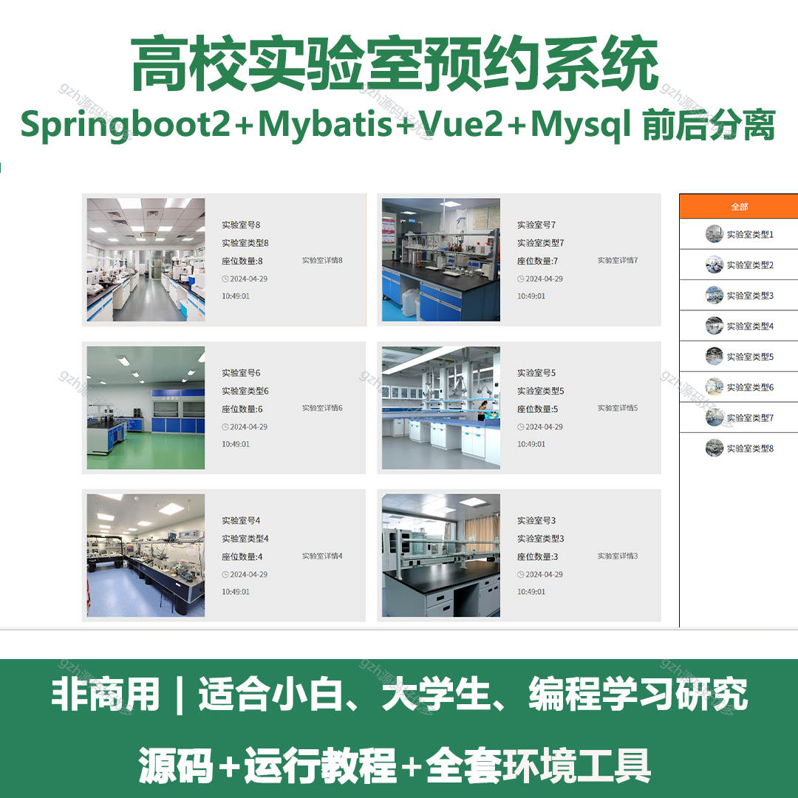
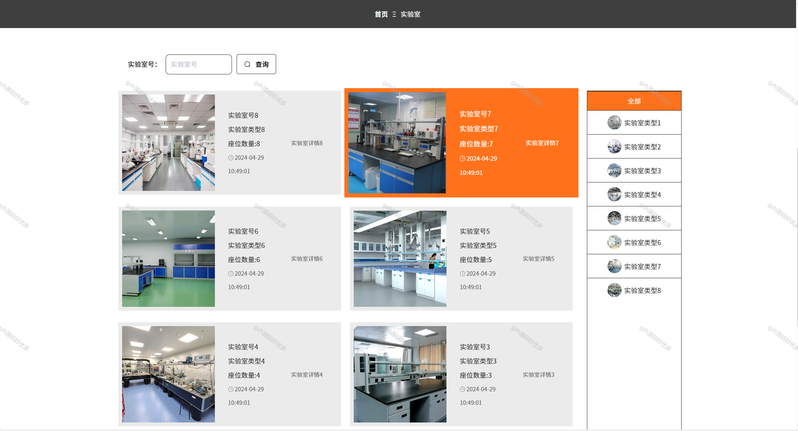
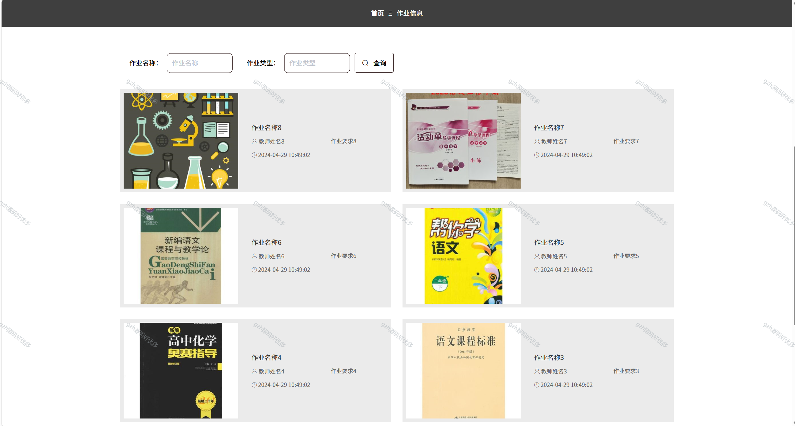
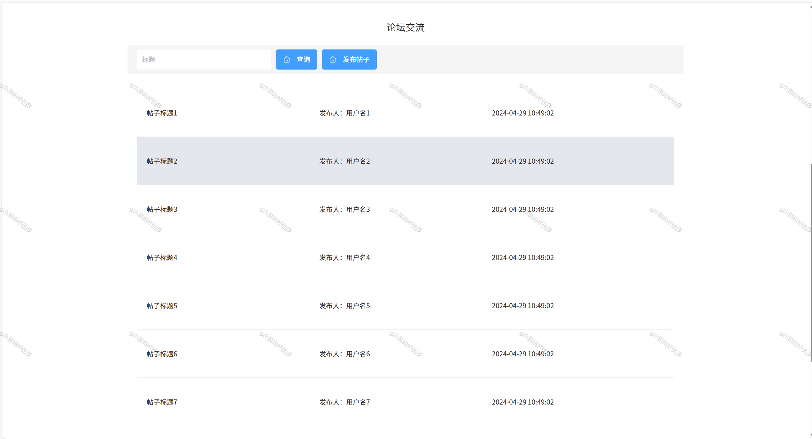
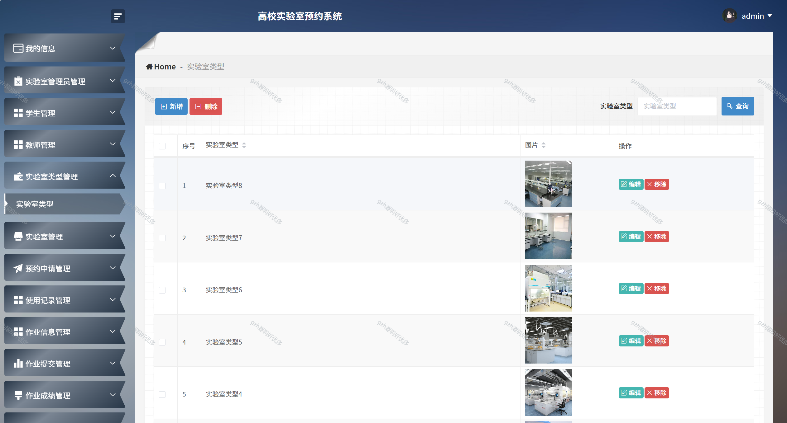
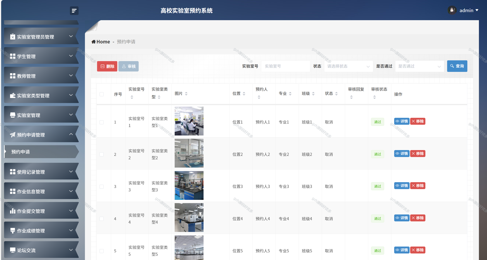
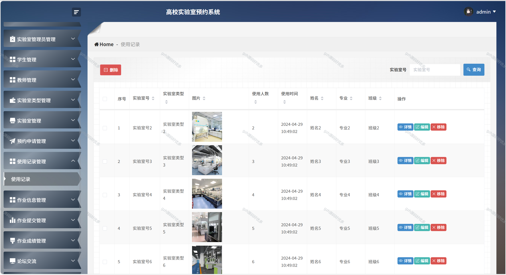
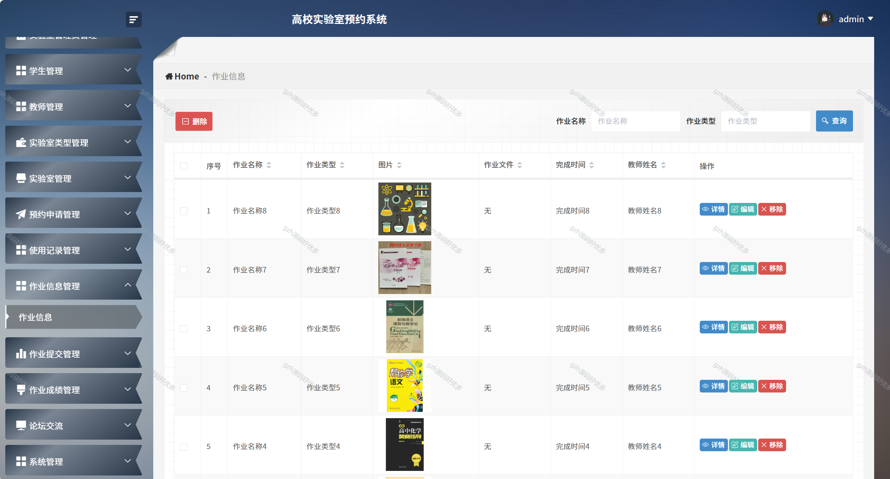

# springbootA233
springbootA233高校实验室预约系统
 
## 查看主页获取源码

### 一、关键词
高校实验室预订系统，大学实验室预约平台，高校实验资源预约系统

### 二、作品包含
源码+数据库+全套环境和工具资源+本地部署教程

### 三、项目技术
前端技术：Html、Css、Js、Vue2.0、Element-ui 
后端技术：Java、SpringBoot2.0、MyBatis

### 四、运行环境（以下版本亲测，其他版本未知，请自测）
开发工具：IDEA/eclipse  + VSCODE

数据库：MySQL5.7（最低要5.7版本）

数据库管理工具：Navicat10以上版本

环境配置软件： JDK1.8 + Maven3.6.3

前端Nodejs：14

浏览器：谷歌浏览器

### 五、项目介绍
项目编号：springbootA233

高校实验室预约系统能规范实验室资源使用，实现高效管理、合理分配，方便师生预约并保障实验顺利开展。
首页：展示系统入口、个人信息及公告等 。
实验室：可查询、浏览不同实验室信息及分类筛选 。
作业信息：能按名称、类型查询作业，查看作业详情 。
论坛交流：支持帖子查询、发布，浏览帖子信息 。
后台管理（管理员端）：涵盖用户（学生、教师、实验室管理员 ）、实验室（类型、预约、使用记录 ）、作业（信息、提交、成绩 ）及论坛、系统管理等，实现增删改查及审核等操作 。

### 六、运行截图

